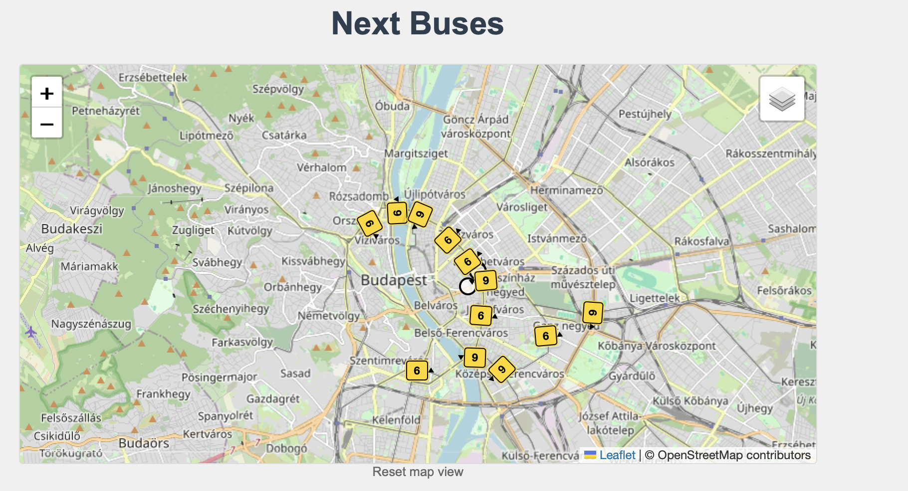
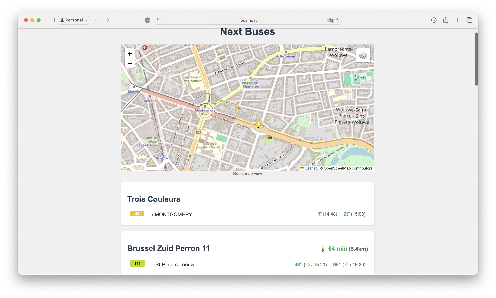

# Public Transport Waiting Times

Creates a dashboard showing waiting times for implemented public transport companies' stops, ordered by distance from a given point (map centre or user's current location).

The aim is for a modular design that allows for easy addition of new transit providers, including in other countries.

Currently supported real-time waiting times:
- Belgium: STIB, De Lijn
- Hungary: BKK

Schedule based waiting times: supported in 70 countries covered by the Mobility Database.

Alongside realtime waiting times, it creates a dashboard to browse stops and routes from static GTFS data that it can dynamically download from the Mobility Database.

## Features
- Real-time waiting times for  buses, trams and metros
- Configurable display of multiple stops
- Auto-refresh of waiting times
- API that can be used by other applications (e.g. a Raspberry Pi display)
- Schedule Explorer: A web interface to explore GTFS schedules and plan routes (beta)






## Use-case
See for example this implementation: [Raspberry Pi Waiting Time Display](https://github.com/bdamokos/rpi_waiting_time_display)

## Getting Started

### Prerequisites

- API keys for STIB and De Lijn (see below) - requires free registration

### Installation
*Docker*

See [DOCKER.md](DOCKER.md) for how to install it directly with Docker.

*Traditional way*
1. Clone this repository
2. Create a virtual environment: `python -m venv .venv`
3. Activate the virtual environment:
   - Windows: `.venv\Scripts\activate`
   - Linux/Mac: `source .venv/bin/activate`
4. Install dependencies: `pip install -r requirements.txt`
5. Copy `local.py.example` to `local.py` and add your API keys to the `.env` file

### Running the Application

You can run all components (legacy app, Schedule Explorer frontend and backend) with a single command:

```bash
python start.py
```

This will start:
- Waiting time dashboard http://localhost:5001 (limited to hardcoded providers)
- Schedule Explorer frontend on http://localhost:8080 (GTFS schedule explorer - allows loading the GTFS data of all providers who are in the Mobility Database and do not require specific authentication)
- Schedule Explorer backend on http://localhost:8000 (GTFS schedule explorer API)

To stop all components, press Ctrl+C.

Alternatively, you can run individual components:
- Legacy app only: `python app/main.py`
- Schedule Explorer backend: `cd app/schedule_explorer && uvicorn backend.main:app --reload`
- Schedule Explorer frontend: `cd app/schedule_explorer/frontend && python -m http.server 8080`

### Running with Docker

1. Copy `docker-compose.yaml.example` to `docker-compose.yaml` and add your API keys to the `.env` file
2. Copy `local.py.example` to `local.py` and add your API keys to the `.env` file - change the variables as needed
3. For outside access, an example is provided using ngrok. See `docker-compose.yaml.example` for details. Otherwise, remove the `ngrok-static` service.
4. Run the application: `docker compose up`
5. Access the application at `http://localhost:5001` or the ngrok URL

## Getting API Access

### STIB/MIVB API

1. Go to the [STIB Open Data Portal](https://opendata.stib-mivb.be/)
2. Create an account and log in
3. Generate your API key in your account settings
4. Add the key to your `.env` file

### De Lijn API

1. Visit the [De Lijn Developer Portal](https://data.delijn.be/)
2. Create an account
3. Subscribe to both:
   - "Open Data Free Subscribe Here" 
   - "De Lijn GTFS Realtime"
   - "De Lijn GTFS Static"
4. Add the keys to your `.env` file

### BKK (Budapest)

1. Visit https://opendata.bkk.hu/data-sources
2. Register and get a key under the key management option
3. Add the keys to your `.env` file

### Mobility Database

1. Go to https://mobilitydatabase.org
2. Create an account
3. Get your API refresh key
4. Add the keys to your `.env` file


## Figuring out stop IDs

General method:

- Go to the GTFS downloader interface of the Schedule Explorer, download the GTFS data for your provider
- Switch to the Stop explorer tab, type in your stop name
- Select the stops that appear, look for the route and direction you want to monitor
- Note down the stop_id for the relevant stop

Note that the Schedule Explorer works with a wide range of providers, the waiting time interface is limited to the 3 providers currently implemented.
  
### Stib
Alternatively:
- Explore the open data portal and find the stop ID (https://opendata.stib-mivb.be/) (You can filter by the 'where' field to narrow down the search. E.g. where: pointid="1234" to get information about a specific stop.)
- Use the [STIB stop finder](https://www.stib-mivb.be/index.htm?l=fr) and look for `stop=` in the URL
- For each line, one direction is designated as "City" and the other as "Suburb" - it is not always the same direction as you might expect.

### De Lijn
Either:
- Use the [De Lijn stop finder](https://www.delijn.be/nl/haltes/) and look for the stop ID in the URL
- Explore the open data portal and find the stop ID (https://data.delijn.be/) (Sometimes it is useful to know that Brussels is under gemeenteeNummer=3)

## Configuration

## Initial Setup

1. Copy the example configuration files:   ```bash
   cp config/local.py.example config/local.py
   cp .env.example .env   ```

2. Edit `config/local.py` to set your:
   - Monitored stops and lines
   - Map center coordinates and zoom level
   - Other custom settings

3. Edit `.env` to add your API keys:
   - STIB/MIVB API key
   - De Lijn API keys (regular, GTFS static, and GTFS realtime)
   - NGROK_AUTHTOKEN (if using ngrok)
   - NGROK_DOMAIN (if using ngrok)

## Configuration Files

- `config/default.py`: Default settings (do not edit)
- `config/local.py`: Your local settings (edit this)
- `.env`: Environment variables and API keys

## Known Issues and Limitations

- The De Lijn setup is not yet fully set up for multiple monitored lines.
- SNCB and TEC are not yet supported.
- Where the API provides multiple languages, English and French are taken as the default, depending on the API. (E.g. Station names for STIB in French, service messages for STIB in English)
- Timetables are not yet supported. (This information is available in the GTFS data of both STIB and De Lijn)
- Initial load is slow because it involves downloading and parsing a large GTFS file.
